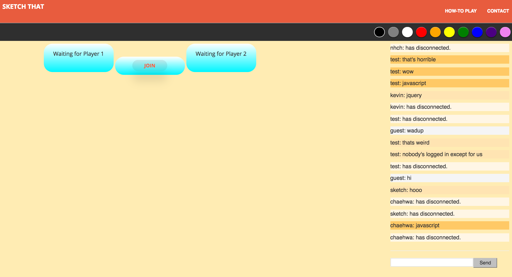

<snippet>
  <content>
# Sketch-It-App
https://sketch-it.herokuapp.com/
 
A game where one user draws, and another guesses! Built with Firebase, Node.js, and Socket.io.

 
 

 

## Installation
Download the github repository.
 
run `npm install`
 
run 'node server.js'

## Usage
Create account or login. Game will start when two players join.  
Each player will have 30 seconds to guess the correct word. Players can message each other.  
Once player types the correct word, sides will switch and the canvas and word will be refreshed.

## Contributing
1. Fork it!
2. Create your feature branch: `git checkout -b my-new-feature`
3. Commit your changes: `git commit -am 'Add some feature'`
4. Push to the branch: `git push origin my-new-feature`
5. Submit a pull request :D

## Credits
Kevin Duong  
Nam Kim  
Kenichi Sugai

## License
MIT

</content>
  </snippet>
