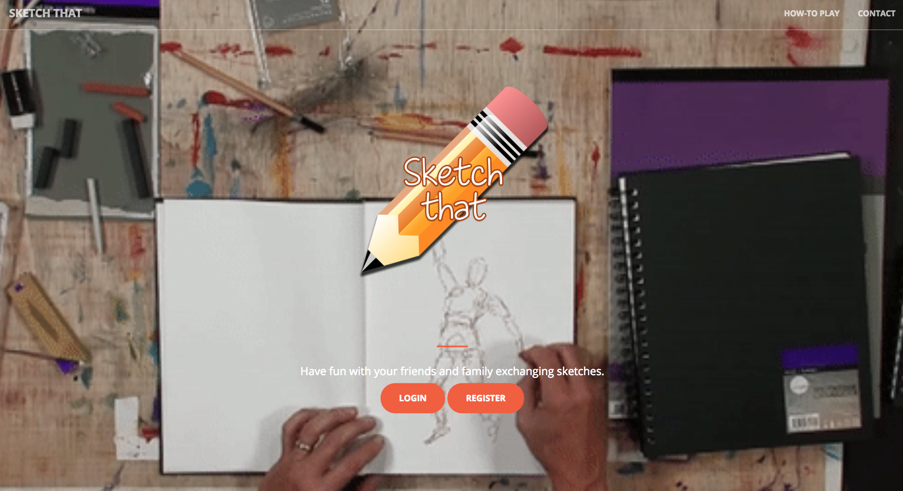

<snippet>
  <content>
# Sketch-It-App
A game where one user draws, and another guesses! Using Node.js, Firebase, with Socket.io and Canvas HTML5.

## Installation
Download the github repository.  
run `npm install`  
run 'node server.js'

## Usage
TODO: Write usage instructions
## Contributing
1. Fork it!
2. Create your feature branch: `git checkout -b my-new-feature`
3. Commit your changes: `git commit -am 'Add some feature'`
4. Push to the branch: `git push origin my-new-feature`
5. Submit a pull request :D
## History
TODO: Write history
## Credits
TODO: Write credits
## License
TODO: Write license
]]></content>
  <tabTrigger>readme</tabTrigger>
</snippet>
